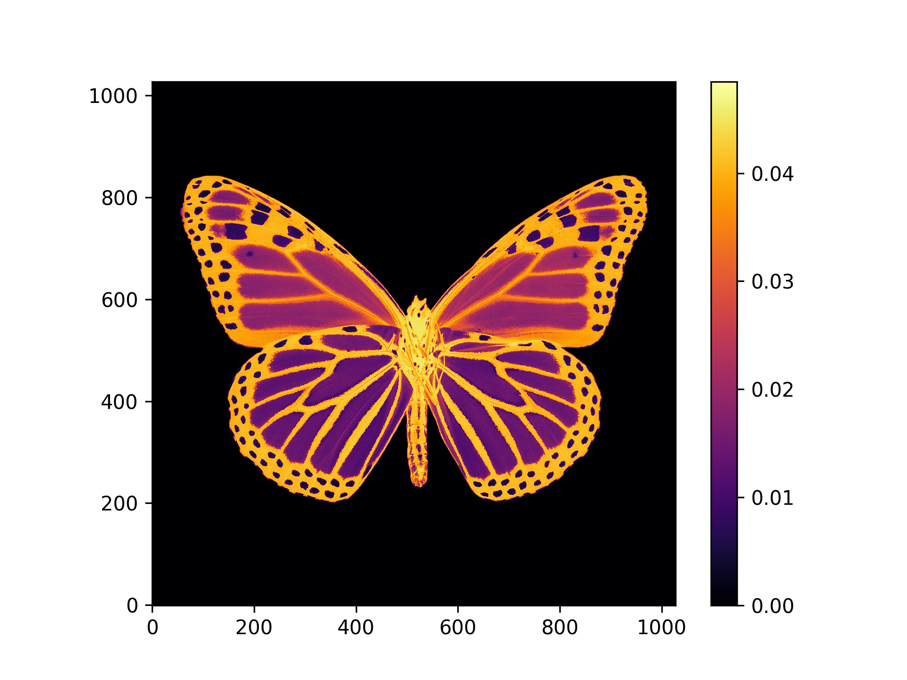

# Setup Mock Image and Baselines

This example generates a mock sky brightness image and a realistic set of baselines $(u,v)$, which are later used by other examples in this repository, and as a fixture within the MPoL test suite. It uses the IM Lup DSHARP dataset for realistic baselines, weight values, and source flux. 

# Prerequisite

You should have already downloaded and extracted the IM Lup DSHARP dataset as described in [Example 00](../00-download-and-extract-datasets/README.md). Then, you will need to copy the `IM_Lup_baselines_and_weights.npz` into this directory in a new `data` folder. For example, from within this 01 folder, run

```shell
$ mkdir data
$ cp ../00-download-and-extract-datasets/data/IM_Lup_baselines_and_weights.npz data/
```

# Installation

You can install necessary Python packages into your environment by
```shell
$ pip install -r requirements.txt
```

and then you can run the code by

```shell 
snakemake -c1 all
```

# Description of Contents

Note that this script does not actually sample mock visibility values $\mathcal{V}(u,v)$. That is done on the fly using `mpol.fourier.generate_fake_data` in scripts like `sgd/src/load_data.py`, so that sky image size, flux, and measurement noise level can be adjusted as needed on demand.

* `create_butterfly.py` downloads a nice looking image from the `ceyda/smithsonian_butterflies` collection, uses PIL to greyscale and crop it, adjusts the flux value to match DSHARP IM Lup, then saves it as a numpy array.
* `package_data.py` combines the two numpy arrays into a single archive, saved as `float32` to save space.

The end result will be this mock image (sourced from `ceyda/smithsonian_butterflies`) stuffed into `data/mock_data.npz`
