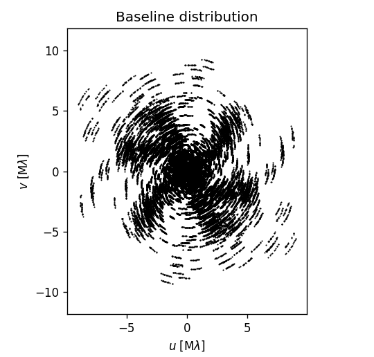
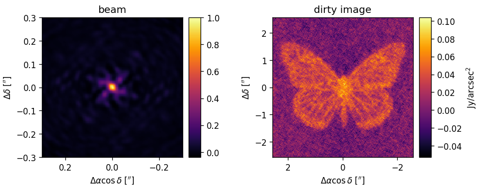
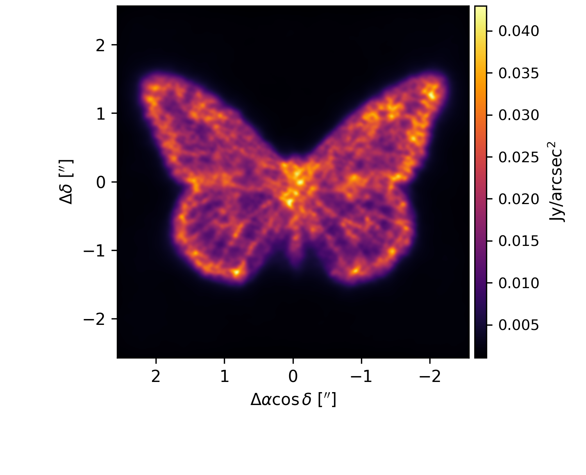

# Stochastic Gradient Descent with Mock Data

This is a complete example demonstrating how MPoL works using simulated data.

# Prerequisites

Before starting, you should have already run the scripts `00` and `01` folders to produce mock baselines. Then, you will need to copy the `mock_data.npz` into this directory in a new `data` folder. For example, from within this 02 folder, run

```shell
$ mkdir data
$ cp ../01-generate-mock-baselines/data/mock_data.npz data/
```

# Installation

You can install necessary Python packages into your environment by
```shell
$ pip install -r requirements.txt
```

and then you can run the code by

```shell 
snakemake -c1 all
```

# Description of Contents

This repository assumes that you will run all scripts from this `02` directory (the one containing `02-sgd/README.md`). Some aspects of the workflow are automated with Snakemake ([`Snakefile`](Snakefile)). 

First, we recommend looking at [`src/load_data.py`](src/load_data.py) to see how mock visibilities $\mathcal{V}(u,v)$ are generated from the mock image and baselines.

Then, we recommend looking at [`src/plot_baselines.py`](src/plot_baselines.py) and [`src/dirty_image.py`](src/dirty_image.py) to make diagnostic plots of the baseline and a dirty image of the data, to check that everything appears as you might expect.

You can run these simple scripts using 

```
$ snakemake -c1 all
```





# RML imaging workflow

The RML imaging workflow is demonstrated in [`src/sgd.py`](src/sgd.py). We recommend looking through that file before reading the rest of this document. If you are new to PyTorch idioms, we recommend familiarizing yourself with the [PyTorch basics](https://mpol-dev.github.io/MPoL/background.html#pytorch) first. 

The RML imaging workflow is not part of the Snakemake workflow, instead, one runs the script like

```
$ python src/sgd.py --epochs=5
```

Note this will just result in a short test. Run `python src/sgd.py --help` to see all available command line arguments, and see below for configurations that will result in better images.

One can visualize the results using Tensorboard via

```shell
$ tensorboard --logdir runs
```

# Validation 
Since this example uses mock data, we have the advantage of knowing the true sky image. This allows us to calculate a 'validation loss' between the synthesized image and the true sky.

$$
L_\mathrm{validation} = \frac{1}{N} \sum_i^N (I_{\mathrm{true},i} - I_{\mathrm{syn}, i})^2
$$

This approach cannot be used with real datasets, obviously, but in this case affords many benefits to precisely quantify the performance of each workflow configuration.

## Varying resolution

If the dataset lacks many long baselines, it is unrealistic for RML to recover the native resolution of the image. In this case, we can calculate the validation score at resolutions coarser than the source image. We do this by convolving both $I_\mathrm{true}$ and $I_\mathrm{syn}$ with a 2D Gaussian described by FWHMs of $\theta_a, \theta_b$  before computing $L_\mathrm{validation}$. 

# Example Result
Here is an example image produced with 

```shell
$ mkdir checkpoints
$ python src/sgd.py --tensorboard-log-dir=runs/ent0 --save-checkpoint=checkpoints/ent0.pt --lr 1e-1 --FWHM 0.05 --epochs=5 --lam-ent=1e-5
```

and plotted with 

```shell
$ python src/plot_image.py checkpoints/ent0.pt analysis/butterfly.png
```




# More examples of training loops
To demonstrate why regularization is needed for imaging workflows, try running without any:

```shell
python src/sgd.py --tensorboard-log-dir=runs/nolam0 --epochs=10 --log-interval=2 --save-checkpoint=checkpoints/nolam0.pt --lr 1e-2
```

If run to convergence, you'll find a classic case of overfitting to the lower S/N visibilities at longer baselines / higher spatial frequencies. This manifests in the image as small splotches and/or individual pixels with very high flux concentrations. If we didn't enforce non-negative pixels by construction, this would probably manifest as high frequency "noise" similar to uniformly-weighted images.

You can spot this behavior by monitoring the training loss and the validation loss with iteration. You will see the [classic textbook signature of overfitting](https://d2l.ai/chapter_linear-regression/generalization.html#underfitting-or-overfitting): the validation loss decreases for a while but eventually turns around and increases, while the training loss monotonically decreases as it fits the signal and then eventually tries to fit all the noise. One could attempt to regularize this behavior away using early stopping. However, in practice with real data we would not have access to a validation, so we look to alternative regularization techniques.

## Maximum Entropy Regularization

One can obtain a decent image using Maximum Entropy Regularization. Here are a few examples that you can run, saving checkpoints and resuming from finished models. We recommend that you examine the output using Tensorboard after each run, and make adjustments accordingly.

Initial run with no entropy:

```shell
python src/sgd.py --tensorboard-log-dir=runs/exp0 --save-checkpoint=checkpoints/0.pt --lr 1e-2 --FWHM 0.05 --epochs=10
```

Resuming from previous model, and speeding up learning rate
```shell
python src/sgd.py --tensorboard-log-dir=runs/exp1 --load-checkpoint=checkpoints/0.pt --save-checkpoint=checkpoints/1.pt --lr 1e-1 --FWHM 0.05 --epochs=30
```

Hastening learning rate yet further,
```shell
python src/sgd.py --tensorboard-log-dir=runs/exp2 --load-checkpoint=checkpoints/1.pt --save-checkpoint=checkpoints/2.pt --lr 4e-1 --FWHM 0.05 --epochs=50
```

Adding entropy regularization, and reducing learning rate slightly.
```shell
python src/sgd.py --tensorboard-log-dir=runs/ent0 --load-checkpoint=checkpoints/2.pt --save-checkpoint=checkpoints/ent0.pt --lr 1e-1 --FWHM 0.05 --epochs=50 --lam-ent=1e-5
```

Note that we could have started directly with the entropy regularization if we wished. This collection just demonstrates an exploratory workflow.