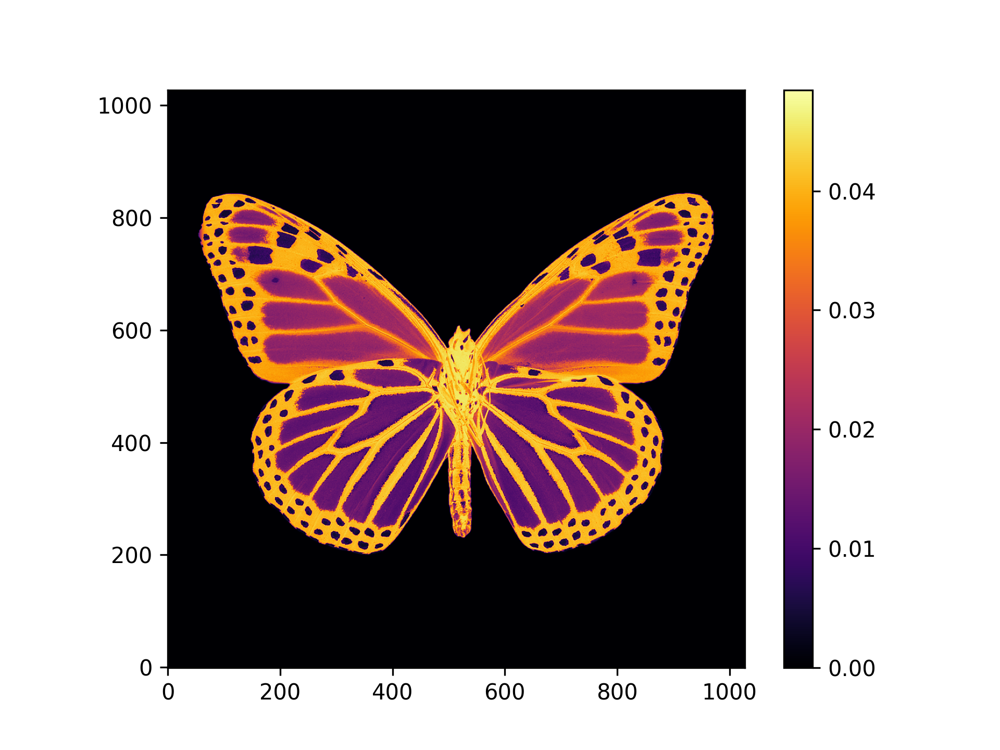

# Setup Mock Image and Baselines

This example generates a mock sky brightness image and a realistic set of baselines $(u,v)$, which are later used by other examples in this repository, and as a fixture within the MPoL test suite. It uses the IM Lup DSHARP dataset for realistic baselines, weight values, and source flux. 

Note that this script does not sample mock visibility values $\mathcal{V}(u,v)$. That is done on the fly using `mpol.fourier.generate_fake_data` in scripts like `sgd/src/load_data.py`, so that sky image size, flux, and measurement noise level can be adjusted as needed.

* `create_butterfly.py` downloads a nice looking image from the `ceyda/smithsonian_butterflies` collection, uses PIL to greyscale and crop it, adjusts the flux value to match DSHARP IM Lup, then saves it as a numpy array.
* `export_baselines.py` uses MPoL-dev/visread and casatools to extract real baselines from the IM Lup measurement set, and saves them as a numpy array. To save space, we take <5% of the visibilities.
* `package_data.py` combines the two numpy arrays into a single archive, saved as `float32` to save space.
* `requirements.txt` lists the python packages necessary for the analysis. You can install them with `pip install -r requirements.txt`
* `Snakefile` is a snakemake file setting up the workflow. From this directory, you can run 

```
$ snakemake -c 1 all
```

Will create this mock image (sourced from `ceyda/smithsonian_butterflies`) stuffed into `data/mock_data.npz`
